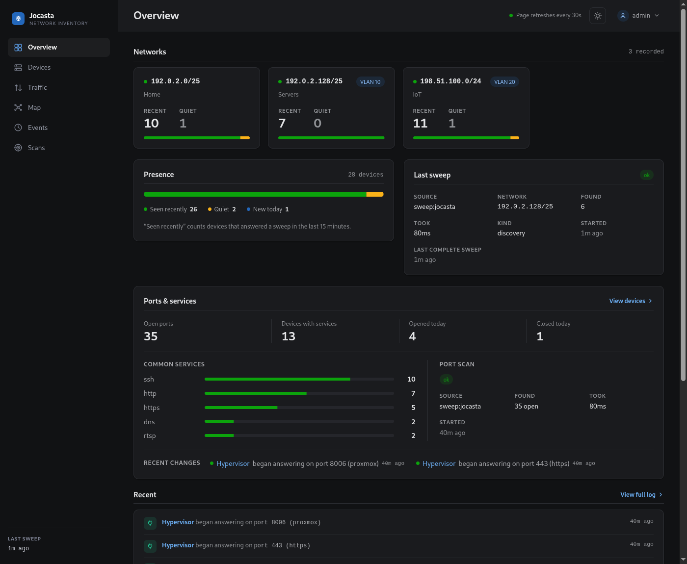

# jocasta

Jocasta keeps an inventory of the devices on your network. It finds them, works
out which physical device each one is, follows them as they move between
addresses, and records what changes over time. A web interface shows the
current picture and the history behind it.

> **Pre-1.0 and under active development.** A release can change the
> configuration format, the database schema or the HTTP API with no upgrade
> path. Pin to a version and check the release notes before moving to the next.



## The problem

Keeping track of what is connected to a network is harder than it sounds:

- Devices come and go, and one that changes its address or its Wi-Fi MAC looks
  like a new device.
- The tools that can list what is connected (an ARP scan, the router's lease
  list, a port scanner) each show one slice of the picture at one moment, and
  none of them remembers.
- A scan from a single machine can only fully identify devices on its own
  network segment. On a network split into VLANs, most devices show up as an
  address and nothing else.

Jocasta exists to give one durable answer to "what is on the network, and what
changed".

## How it works

Jocasta identifies a device by its hardware (MAC) address rather than its IP.
An IP is treated as a lease the device currently holds, so the label, group and
notes you attach to a device stay with it when the address changes.

Alongside its own network sweep, Jocasta reads the ARP and DHCP tables from
your router. The router sees every network segment, so devices that a
single-machine scan would miss are identified properly, with a vendor and a
name.

Every device discovered, every address gained or dropped, and every rename is
written to a change log you can review. Jocasta looks at the network only when
you tell it to, on a schedule you set or on demand. It does not scan
continuously.

## What you get

| | |
|---|---|
| Device inventory | Every device, its addresses, the segment each address is on, its vendor and name, and when it was last seen. |
| Your own labels | Give a device a label, a group and notes, or mark it to ignore. Scans never overwrite these. |
| Network view | Each segment, and its VLAN, as its own page with the devices on it. |
| Change log | A timestamped record of discoveries, moves and renames, per device and across the whole network. |
| Web interface | Overview dashboard, searchable and filterable device list, per-device and per-network pages, light and dark themes. |
| API | A JSON API over the same data, for scripts and dashboards. |
| MCP server | An optional [MCP](https://modelcontextprotocol.io) endpoint, so AI agents such as Claude Code can query the inventory, triage devices and report on changes. |
| Self-contained | A single binary with an embedded database. No separate services to run. |

More screenshots: [docs/ui.md](docs/ui.md).

## Quick start

Write a minimal `jocasta.yaml` naming the networks to sweep:

```yaml
networks:
  - "192.0.2.0/24"

auth:
  cookie_secure: false   # only while you reach it over plain HTTP, not HTTPS
```

Run the container on the host network, so it can read hardware addresses:

```bash
docker run -d --name jocasta --network host \
  -v jocasta-data:/data \
  -v ./jocasta.yaml:/data/jocasta.yaml:ro \
  ghcr.io/pushkar-anand/jocasta:latest
```

Open `http://<host>:8080` and create the admin account. The first sweep runs
straight away and then every five minutes.

Every other setting, with its default, is in
[`jocasta.example.yaml`](jocasta.example.yaml). For binaries, building from
source and reading your router, see [setup](docs/setup.md).

## Documentation

- [Setup](docs/setup.md): other ways to install, configuration, and reading
  devices from your router.
- [CLI](docs/cli.md): one-off sweeps, port scans and source reads from the
  command line.
- [MCP server](docs/mcp.md): connecting AI agents to the inventory.
- [The web UI](docs/ui.md): a tour of the interface.
- [Development](docs/development.md): building and working on jocasta.

## License

Jocasta is released under the [GNU AGPL-3.0](LICENSE).

Jocasta embeds third-party data:

- MAC vendor names from the [IEEE registries](https://standards.ieee.org/products-programs/regauth/)
  and [Wireshark's manufacturer table](https://www.wireshark.org/).
- [IP to ASN data](https://db-ip.com/db/download/ip-to-asn-lite) by
  [DB-IP](https://db-ip.com), licensed under
  [CC BY 4.0](https://creativecommons.org/licenses/by/4.0/).
