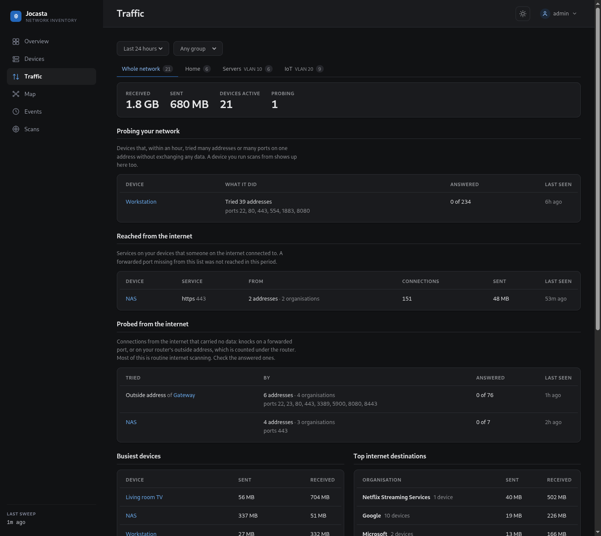
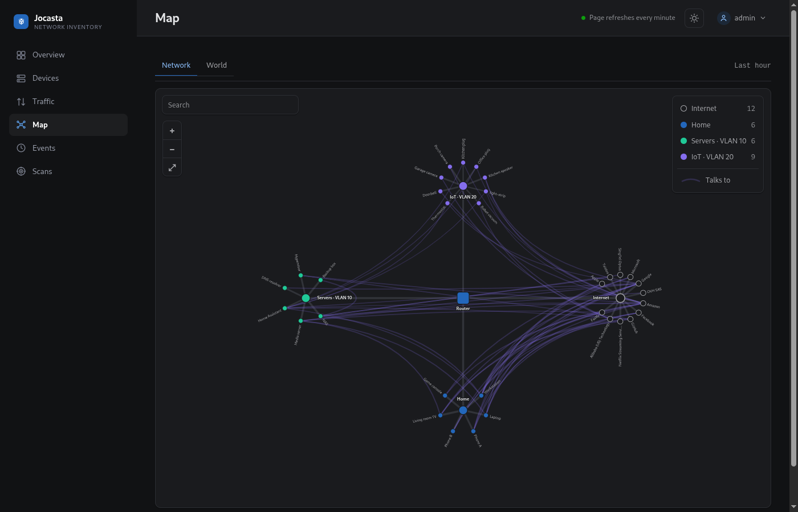

# The web UI

The pages `jocasta serve` shows. They read the same data as the JSON API, and
the Overview and Map refresh themselves.

The screenshots below use synthetic data: addresses from RFC 5737, hardware
addresses from RFC 7042, invented names. The internet peers are well-known
public services, so their organisations resolve.

## Overview

Per-network counts, a presence summary, the last sweep, and recent changes.

## Device list

Filter by group, network or presence. Search by name, address or vendor.
Ignored devices are hidden unless you ask for them.

## Device page

Everything Jocasta knows about one device:

- Identity: what Jocasta resolved the device to be, and whether it is known by
  its hardware address or only its IP.
- What you call it: label, group, type and notes. No scan or plugin writes
  these.
- Addresses: every address the device has held, and the network each is on.
- Ports: once a port scan has reached the device (see [CLI](cli.md#ports)),
  the TCP ports it listens on, and the ones it has since closed.
- Sources: what each source, such as the sweep or the router, calls the
  device, and when it last heard from it.
- History: the device's entries in the change log.

### Talks to

When traffic collection is set up (see
[Record who devices talk to](setup.md#record-who-devices-talk-to)), this
section shows who the device exchanged data with over the last 24 hours, 7
days or 30 days.

The top of the section shows data received and sent, how many peers on your
network, and how many organisations on the internet. Below that is one tab per
network segment and one for the internet, each with a count. The busiest tab
opens first.

On a segment's tab, each peer is one row, whatever services it was reached on,
and links to its page when it is a device. Addresses no device holds collapse
into one row per subnet. The Internet tab groups addresses by the organisation
that announces them. The search box and the filters narrow the section to one
service, or by name, address or organisation.

Each row shows who opened its connections: "→ 12" means the device opened
twelve, "← 3" means the peer opened three. A row can show both. The direction
filter keeps one side only.

When something on the internet tried the device without exchanging any data,
such as a knock on a forwarded port, a note says how many addresses tried,
from how many organisations, and on which ports. Tries on the router's outside
address are counted under the router. Jocasta learns that address from the
flows themselves.

Connections the device started that carried no data (a refused port, one
nobody answered, a ping) are counted at the top and left out of the tabs. Tick
"Show tries with no data" to add each to the row of the peer it went to, with
how many got an answer and the ports tried. When they add up to probing the
network, a notice at the top says so.

The Broadcasts tab lists packets the device sent to a whole subnet or
multicast group. These are mostly discovery protocols,
such as mDNS, SSDP, DHCP or a sync tool finding its peers. Names are guessed
from the port and group.

## Traffic page

When traffic collection is set up, this page summarises the whole network over
the last 24 hours, 7 days or 30 days. Its cards:

- **Probing your network**: devices that, within an hour, tried 20 or more
  addresses, or 20 or more ports on one address, without exchanging any data.
  A device you run scans from shows up here too.
- **Reached from the internet**: each device and service that someone on the
  internet connected to.
- **Probed from the internet**: connections from the internet that carried no
  data, per device and on the router's outside address.
- **Busiest devices** and **Top internet destinations**. Each organisation
  opens to the devices behind it.
- **New this week**: organisations a device first exchanged data with in the
  last 7 days.

A tab per network segment narrows every card to that segment's devices, with
its totals at the top. You can also narrow the page to one group.

If the router's outside address is itself private, because the ISP's
carrier-grade NAT or another router sits in front of it, the page says so.
Nothing on the internet can connect in over IPv4 then, so the two internet
cards stay empty.

## Map

When traffic collection is set up, the Map draws the last hour's traffic as a
tree. It redraws every minute, which is how often new traffic is recorded.

- The router sits in the middle, with a hub for each network and one for the
  internet.
- Devices and organisations fan out around their hub. The busiest 60 devices
  and 12 organisations are drawn.
- A branch is thicker the more traffic passed along it, and moves when
  anything under it was active in the last 15 minutes.
- A faint line joins each device to what it exchanged traffic with: an
  organisation, or a device on another network. Traffic between two devices on
  the same network never passes the router, so it is not drawn.
- The legend in the top right names each network's colour with its device
  count. Point at one to pick out its devices.

Click a device or organisation to light up its lines, name the services on
each ("https", "mqtts", "port 123 UDP") and dim everything else. Click the
device again to open its page. Click the empty map or press Escape to go back.

Scroll or pinch to zoom, drag to pan, and double-click to zoom in on a spot.
The search box dims everything that does not match, and Enter zooms to the
first match. The view, the search and each device's place are kept across
redraws.

### World

The World tab puts the same hour's internet traffic on a map of the world.

- A country is shaded darker the more traffic went to addresses registered
  there. A marker pulses on the ones active in the last 15 minutes.
- A line runs from your network's country to each of the others, thicker the
  more it carried and moving while active.
- Click a country for the devices and organisations behind its traffic. The
  search finds countries by name.

Your network's country comes from the router's outside address, or from
`location.country` when that address is private (see
[Record who devices talk to](setup.md#record-who-devices-talk-to)).

A country is where an address is registered. For a big provider that is often
its home country, and the server itself may be elsewhere.

## Network page

One segment, its VLAN tag and name, and the devices on it.

## Events

The full change log.

## Light theme

A toggle in the header switches themes; the choice is stored per browser.

