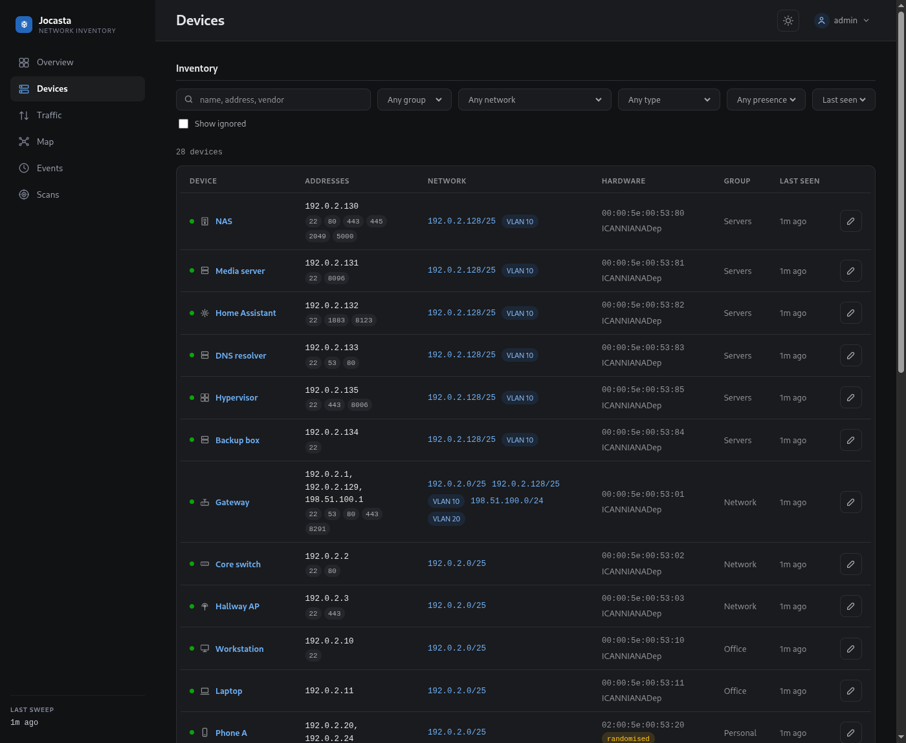
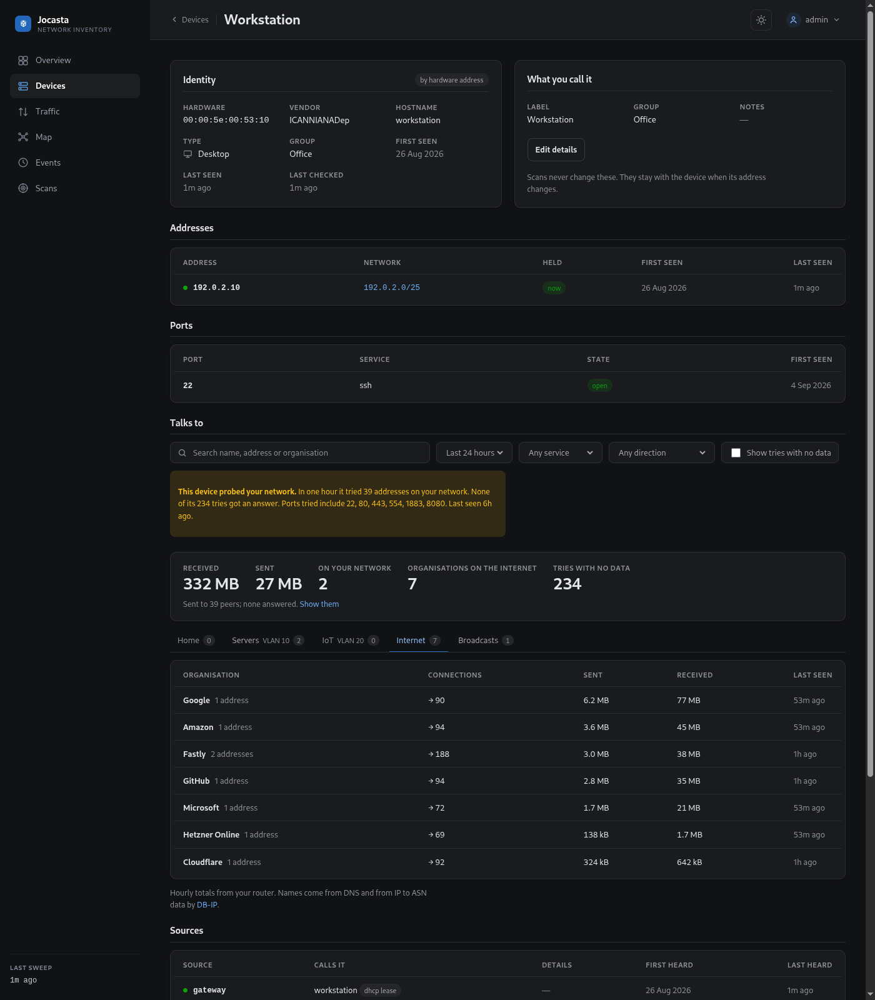
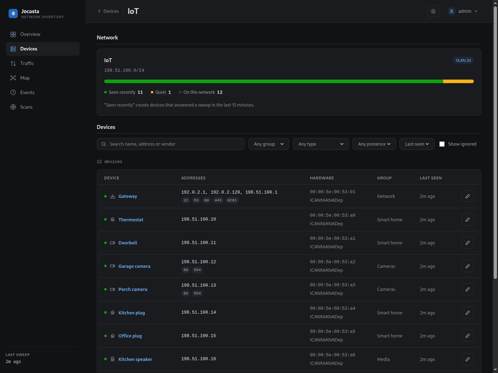
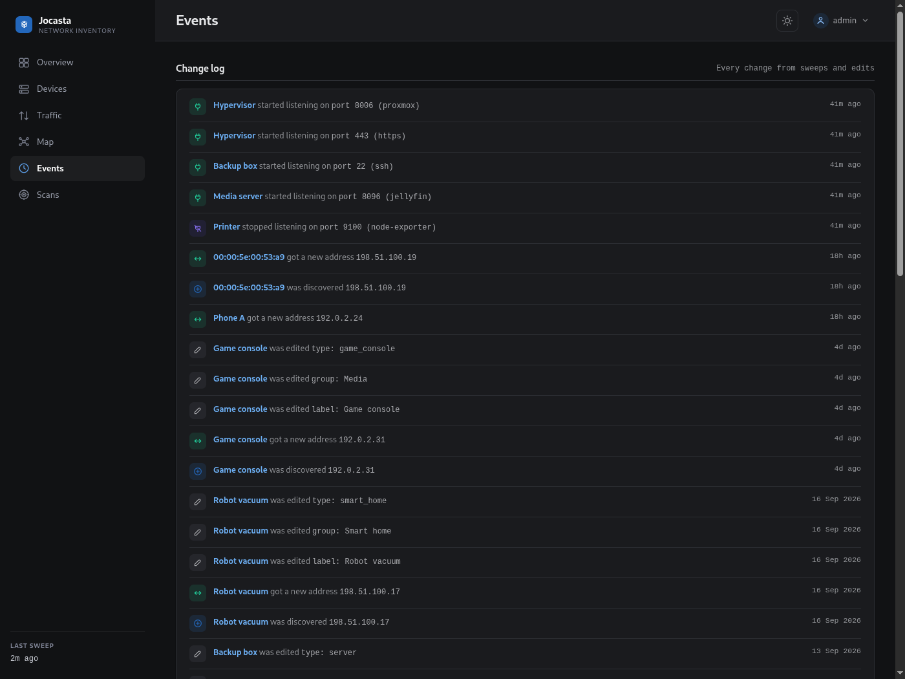
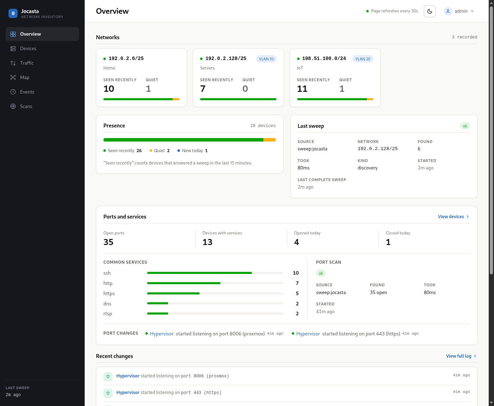

# The web UI

`jocasta serve` runs a web interface over the same store the JSON API reads.
Pages are server-rendered; htmx handles in-place updates and the periodic
refresh.

The screenshots below use synthetic data: addresses from RFC 5737, hardware
addresses from RFC 7042, invented names.

## Overview

Per-network counts, a presence summary, the last sweep, and recent changes.

## Device list

Filter by group, network or presence. Search by name, address or vendor.
Ignored devices are hidden unless you ask for them.

## Device page

Shows the identity Jocasta resolved, the user-owned fields (label, group, type,
notes, which no scan or plugin writes), every address the device holds and its
network, and what each source calls the device. Once a port scan has reached the
device (see [CLI](cli.md#ports)), a Ports section lists the TCP ports it was
found listening on, and the ones it has since stopped answering on as closed.

When traffic collection is set up (see
[Seeing who devices talk to](setup.md#seeing-who-devices-talk-to)), a Talks to
section shows who the device exchanged data with over the last 24 hours, 7 days
or 30 days. It opens with the period at a glance -- received, sent, how many
peers on your network and organisations on the internet -- and then has one tab
per network segment and one for the internet, each with a count, opening on the
busiest. On a segment's tab each peer is one row whatever services it was
reached on, linked to its page when it is a device, and addresses no device
holds collapse into one row per subnet. The Internet tab groups addresses by
the organisation that announces them. The section can be narrowed to one
service, or by a search over names, addresses and organisations.

Each row, organisation and service says who opened its connections: "→ 12"
the device opened twelve, "← 3" the peer opened three, and a row can carry
both. A direction filter keeps only the peers the device opened connections to,
or only those that opened connections to it, and the figures at the top count
how many connections the internet opened. On the Traffic page, "Reached from the
internet" lists each device and service someone on the internet connected to:
what the network exposes, as it was used.

When something on the internet tried the device without the connection
carrying anything -- a forwarded port knocked on -- a note says how many
addresses tried, from how many organisations, and which ports. Tries on the
router's outside address are counted under the router, whose address the flows
themselves reveal: every connection out through the router names the address
it left with. The Traffic page lists these under "Probed from the internet".
When that outside address is itself private -- the router sits behind the
ISP's carrier-grade NAT, or another router -- the page says so: nothing on the
internet can open a connection in over IPv4, and both cards stay empty.

Connections the device started that never carried data -- a port that
refused, one nobody answered, a ping -- are counted at the top and left out of
the tabs until "Show tries with no data" is ticked; then each sits on the row
of the peer it went to, with how many were answered and the ports tried. When
they add up to probing the network, a notice at the top of the section says
so.

What a device sent to everyone rather than to one host -- a broadcast to its
subnet or to every host on the segment, or a packet to a multicast group -- has
a Broadcasts tab of its own: discovery protocols announcing the device or
looking for others, such as mDNS, SSDP, DHCP or a sync tool finding its peers,
with how many packets went and when. Names are guessed from the port and
group, not read from the packets.

## Traffic page

When traffic collection is set up, the Traffic page summarises the whole
network over the last 24 hours, 7 days or 30 days: the busiest devices, the
organisations the network exchanges the most with, and which devices started
talking to an organisation for the first time this week. Each organisation is
one row that opens to the devices behind it. A tab per network segment narrows
every card to the devices on that segment, with the segment's totals at the
top, and the page can be narrowed to one group's devices as well.

Its first card, "Probing your network", lists devices that within one hour
tried 20 or more addresses on your network, or 20 or more ports on one of
them, without the connections carrying data: what a scan looks like. A host
you run scans from appears there too.

## Map

The Map draws the last hour's traffic as a tree. The router is in the
middle, with a hub for each network and one for the internet around it. Each
network's devices, and the internet's organisations, fan out around their
hub. A branch is thicker the more traffic passed along it, and moves when
anything under it was active in the last 15 minutes. The page redraws itself
every minute, which is how often new traffic is recorded.

Over the tree, a faint line joins each device to what it exchanged traffic
with: an organisation, or a device on another network. Click a device or an
organisation to light its lines, name the services on each ("https", "port
8883") and dim everything else; click the device again to open its page, and
click the empty map or press Escape to go back. A device talking to one on the
same network is not drawn, since that traffic never passes the router.

Scroll or pinch to zoom, drag to pan, and double-click to zoom in on a spot;
the buttons zoom and show the whole map again. The search box dims everything
that does not match, and Enter zooms to the first match and selects it. The view and the
search are kept across each redraw, and devices keep their place. The legend
in the top right names each network's colour with its device count; pointing
at one picks its devices out. The busiest 60 devices and 12 organisations are
drawn, and each device links to its page.

## Network page

One segment, its VLAN tag and name, and the devices on it.

## Events

The full change log.

## Light theme

A toggle in the header switches themes; the choice is stored per browser.

